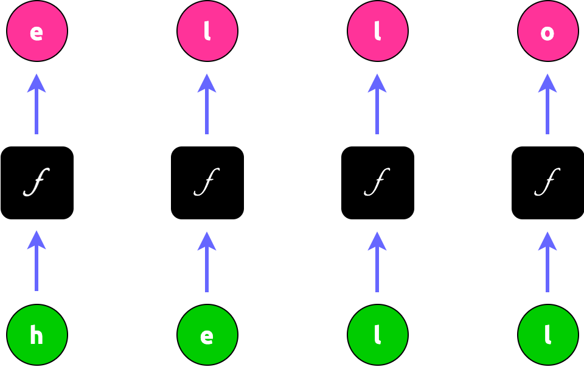

================================================
Introduction to Recurrent Neural Networks (RNNs)
================================================

.. admonition:: Prerequisite

    This article has the following prerequisites:

    1. *Chapter 4 - Artificial Neural Networks* (p. 81) of `MACHINE LEARNING by Mitchell, Thom M. (1997)`_ Paperback
    2. *Deep Learning (Adaptive Computation and Machine Learning series), Ian Goodfellow*

.. contents:: Table of Contents
    :depth: 2

We all heard of this buz word "LLM" (Large Language Model). But let's put that aside for just a second and look at a
much simpler one called "character-level language model" where, for example, we input a prefix of a word such as
"hell" and the model outputs a complete word "hello". That is, this language model predicts the next character of a
character sequence

This is like a Math function where we have:

.. math::

    f(\text{“hell"}) = \text{“hello"}

.. NOTE::

    We call inputs like "hell" as **sequence**

How do we obtain a function like this? One approach is to have 4 black boxes, each of which takes a single character as
input and calculates an output:

But one might have noticed that if the 3rd function (box) produces :math:`f(‘l') = ‘l'`, then why would the 4th function
(box), given the same input, gives a different output of 'o'? This suggest that we should take the "**history**" into
account. Instead of having :math:`f` depend on 1 parameter, we now have it take 2 parameters.

1: a character;
2: a variable that summarizes the previous calculations:

   .. figure:: ../img/rnn-4-black-boxes-connected.png
       :align: center
       :width: 50%

Now it makes much more sense with:

.. math::

    f(\text{‘l'}, h_2) = \text{‘l'}

    f(\text{‘l'}, h_3) = \text{‘o'}

But what if we want to predict a longer or shorter word? For example, how about predicting "cat" by "ca"? That's simple,
we will have 2 black boxes to do the work.

.. figure:: ../img/rnn-multi-sequences.png
    :align: center

What if the function :math:`f` is not smart enough to produce the correct output everytime? We will simply collect a lot
of examples such as "cat" and "hello", and feed them into the boxes to train them until they can output correct
vocabulary like "cat" and "hello".

This is the idea behind RNN

- It's recurrent because the boxed function gets invoked repeatedly for each element of the sequence. In the case of our
  character-level language model, element is a character such as "e" and sequence is a string like "hell"

  .. figure:: ../img/rnn.png
      :align: center

Each function :math:`f` is a network unit containing 2 perceptrons. One perceptron computes the "history" like
:math:`h_1`, :math:`h_2`, :math:`h_3`. Its formula is very similar to that of perceptron:

.. math::

    h^{(t)} = g_1\left( W_{hh}h^{(t - 1)} + W_{xh}x^{(t)} + b_h \right)

where :math:`t` is the index of the "black boxes" shown above. In our example of "hell",
:math:`t \in \{ 1, 2, 3, 4 \}`

The other perceptron computes the output like 'e', 'l', 'l', 'o'. We call those value :math:`y` which is computed as

.. math::

    o^{(t)} = g_2\left( W_{yh}h^{(t)} + b_o \right)

.. admonition:: What are :math:`g_1` and :math:`g_2`?

    They are *activation functions* which are used to change the linear function in a perceptron to a non-linear
    function. Please refer to `MACHINE LEARNING by Mitchell, Thom M. (1997)`_ Paperback (page 96) for why we bump it
    to non-linear

    A typical activation function for :math:`g_1` is :math:`tanh`:

    .. math::

        tanh(x) = \frac{e^x - e^{-x}}{e^x + e^{-x}}

    In practice, :math:`g_2` is constance, i.e. :math:`g_2 = 1`

Forward Propagation Equations for RNN
-------------------------------------

We now develop the forward propagation equations for the RNN. We assume the hyperbolic tangent activation function and
that the output is discrete, as if the RNN is used to predict words or characters. A natural way to represent discrete
variables is to regard the output :math:`\boldsymbol{o}` as giving the unnormalized log probabilities of each possible value of
the discrete variable. We can then apply the softmax (we will disucss softmax function in the next section) operation as
a post-processing step to obtain a vector :math:`\boldsymbol{\hat{y}}` of normalized probabilities over the output. Forward
propagation begins with a specification of the initial state :math:`\boldsymbol{h}^{(0)}`. Then, for each time step from
:math:`t = 1` to :math:`t = \tau`, we apply the following update equations:

.. math::

    \color{green} \boxed{
        \begin{gather*}
            \boldsymbol{h}^{(t)} = \tanh\left( \boldsymbol{W_{hh}}h^{(t - 1)} + \boldsymbol{W_{xh}}x^{(t)} + \boldsymbol{b_h} \right) \\ \\
            \boldsymbol{o}^{(t)} = \boldsymbol{W_{yh}}\boldsymbol{h}^{(t)} + \boldsymbol{b_o} \\ \\
            \boldsymbol{\hat{y}} = softmax(\boldsymbol{o}^{(t)})
        \end{gather*}
    }

Note that this recurrent network maps an input sequence to an output sequence of the same length.

Loss Function of RNN
--------------------

According to the discussion of `MACHINE LEARNING by Mitchell, Thom M. (1997)`_, the key for training RNN or any neural
network is through "specifying a measure for the training error". We call this measure a *loss function*.

In RNN, the total loss for a given sequence of input :math:`\boldsymbol{x}` paired with a sequence of expected
:math:`\boldsymbol{y}` is the sum of the losses over all the time steps, i.e.

.. math::

    \mathcal{L}\left( \{ \boldsymbol{x}^{(1)}, ..., \boldsymbol{x}^{(\tau)} \}, \{ \boldsymbol{y}^{(1)}, ..., \boldsymbol{y}^{(\tau)} \} \right) = \sum_t^{\tau} \mathcal{L}^{(t)} = \sum_t^{\tau}\log\boldsymbol{\hat{y}}^{(t)}

Why would we have :math:`\mathcal{L}^{(t)} = \log\boldsymbol{\hat{y}}^{(t)}`? We need to learn *Softmax Activation* first.

.. admonition:: Softmax Function by `Wikipedia <https://en.wikipedia.org/wiki/Softmax_function>`_

    The softmax function takes as input a vector :math:`z` of :math:`K` real numbers, and normalizes it into a
    probability distribution consisting of :math:`K` probabilities proportional to the exponentials of the input
    numbers. That is, prior to applying softmax, some vector components could be negative, or greater than one; and
    might not sum to 1; but after applying softmax, each component will be in the interval :math:`(0, 1)` and the
    components will add up to 1, so that they can be interpreted as probabilities. Furthermore, the larger input
    components will correspond to larger probabilities.

    For a vector :math:`z` of :math:`K` real numbers, the the standard (unit) softmax function
    :math:`\sigma: \mathbb{R}^K \mapsto (0, 1)^K`, where :math:`K \ge 1` is defined by

    .. math::

        \sigma(\boldsymbol{z})_i = \frac{e^{z_i}}{\sum_{j = 1}^Ke^{z_j}}

    where :math:`i = 1, 2, ..., K` and :math:`\boldsymbol{x} = (x_1, x_2, ..., x_K) \in \mathbb{R}^K`

In the context of RNN,

.. math::

    \sigma(\boldsymbol{o})_i = -\frac{e^{o_i}}{\sum_{j = 1}^ne^{o_j}}

where

- :math:`n` is the length of a sequence feed into the RNN
- :math:`o_i` is the output by perceptron unit `i`
- :math:`i = 1, 2, ..., n`,
- :math:`\boldsymbol{o} = (o_1, o_2, ..., o_n) \in \mathbb{R}^n`

The softmax function takes an N-dimensional vector of arbitrary real values and produces another N-dimensional vector
with real values in the range (0, 1) that add up to 1.0. It maps :math:`\mathbb{R}^N \rightarrow \mathbb{R}^N`

.. math::

     \sigma(\boldsymbol{o}): \begin{pmatrix}o_1\\o_2\\\dots\\o_n\end{pmatrix} \rightarrow \begin{pmatrix}\sigma_1\\\sigma_2\\\dots\\\sigma_n\end{pmatrix}

This property of softmax function that it outputs a probability distribution makes it suitable for probabilistic
interpretation in classification tasks. Neural networks, however, are commonly trained under a log loss (or
cross-entropy) regime

We are going to compute the derivative of the softmax function because we will be using it for training our RNN model
shortly. But before diving in, it is important to keep in mind that Softmax is fundamentally a vector function. It takes
a vector as input and produces a vector as output; in other words, it has multiple inputs and multiple outputs.
Therefore, we cannot just ask for "the derivative of softmax"; We should instead specify:

1. Which component (output element) of softmax we're seeking to find the derivative of.
2. Since softmax has multiple inputs, with respect to which input element the partial derivative is computed.

What we're looking for is the partial derivatives of

.. math::

    \frac{\partial \sigma_i}{\partial o_k} = \frac{\partial }{\partial o_k} \frac{e^{o_i}}{\sum_{j = 1}^ne^{o_j}}

:math:`\frac{\partial \sigma_i}{\partial o_k}` **is the partial derivative of the i-th output with respect with the
k-th input**.

We'll be using the quotient rule of derivatives. For :math:`h(x) = \frac{f(x)}{g(x)}` where both :math:`f` and :math:`g`
are differentiable and :math:`g(x) \ne 0`, The `quotient rule <https://en.wikipedia.org/wiki/Quotient_rule>`_ states
that the derivative of :math:`h(x)` is

.. math::

    h'(x) = \frac{f'(x)g(x) - f(x)g'(x)}{g^2(x)}

In our case, we have

.. math::

    f'(o_k) = \frac{\partial}{\partial o_k} e^{o_i} = \begin{cases}
                                                          e^{o_k}, & \text{if}\ i = k \\
                                                          0,       & \text{otherwise}
                                                      \end{cases}

.. math::

    g'(o_k) = \frac{\partial}{\partial o_k} \sum_{j = 1}^ne^{o_j} = \left( \frac{\partial e^{o_1}}{\partial o_k} + \frac{\partial e^{o_2}}{\partial o_k} + \dots + \frac{\partial e^{o_k}}{\partial o_k} + \dots + \frac{\partial e^{o_n}}{\partial o_k} \right) = \frac{\partial e^{o_k}}{\partial o_k} = e^{o_k}

The rest of it becomes trivial then. When :math:`i = k`,

.. math::

    \frac{\partial \sigma_i}{\partial o_k} = \frac{e^{o_k} \sum_{j = 1}^ne^{o_j} - e^{o_k} e^{o_i}}{\left( \sum_{j = 1}^ne^{o_j} \right)^2}
                                           = \frac{e^{o_i} \sum_{j = 1}^ne^{o_j} - e^{o_i} e^{o_i}}{\left( \sum_{j = 1}^ne^{o_j} \right)^2}
                                           = \frac{e^{o_i}}{\sum_{j = 1}^ne^{o_j}} \frac{\sum_{j = 1}^ne^{o_j} - e^{o_i}}{\sum_{j = 1}^ne^{o_j}} \\

                                           = \sigma_i\left( \frac{\sum_{j = 1}^ne^{o_j}}{\sum_{j = 1}^ne^{o_j}} - \frac{e^{o_i}}{\sum_{j = 1}^ne^{o_j}} \right)
                                           = \sigma_i \left( 1 - \sigma_i \right)

When :math:`i \ne k`

.. math::

    \frac{\partial \sigma_i}{\partial o_k} = \frac{-e^{o_k} e^{o_i}}{\left( \sum_{j = 1}^ne^{o_j} \right)^2} = -\sigma_i\sigma_k

This concludes the derivative of the softmax function:

.. math::

    \frac{\partial \sigma_i}{\partial o_k} = \begin{cases}
                                                 \sigma_i \left( 1 - \sigma_i \right), & \text{if}\ i = k \\
                                                 -\sigma_i\sigma_k,                    & \text{otherwise}
                                             \end{cases}

Cross-Entropy
"""""""""""""

.. admonition:: Cross-Entropy `Wikipedia <https://en.wikipedia.org/wiki/Cross-entropy>`_

    In information theory, the cross-entropy between two probability distributions :math:`p` and :math:`q` over the same
    underlying set of events measures the average number of bits needed to identify an event drawn from the set if a
    coding scheme used for the set is optimized for an estimated probability distribution :math:`q`, rather than the
    true distribution :math:`p`

Confused? Let's put it in the context of Machine Learning.

Machine Learning sees the world based on probability. The "probability distribution" identifies the various tasks to
learn. For example, a daily language such as English or Chinese, can be seen as a probability distribution. The
probability of "name" followed by "is" is far greater than "are" as in "My name is Jack". We call such language
distribution :math:`p`. The task of RNN (or Machine Learning in general) is to learn an approximated distribution of
:math:`p`; we call this approximation :math:`q`

"The average number of bits needed" is can be seen as the distance between :math:`p` and :math:`q` given an event. In
analogy of language, this can be the *quantitative* measure of the deviation between a real language phrase
"My name is Jack" and "My name are Jack".

At this point, it is easy to image that, in the Machine Learning world, the cross entropy indicates the distance between
what the model believes the output distribution should be and what the original distribution really is.

Now we have an intuitive understanding of cross entropy, let's formally define it.

The cross-entropy of the discrete probability distribution :math:`q` relative to a distribution :math:`p` over a given
set is defined as

.. math::

    H(p, q) = -\sum_x p(x)\log q(x)

In RNN, the probability distribution of :math:`q(x)` is exactly the softmax function we defined earlier:

.. math::

    \mathcal{L} = -\sum_i p(i)\log\sigma(\boldsymbol{o})_i = -\sum_i \log\sigma(\boldsymbol{o})_i = -\log\boldsymbol{\hat{y}}^{(t)}

where

- :math:`\boldsymbol{o}` is the predicted sequence by RNN and :math:`o_i` is the i-th element of the predicted sequence

.. admonition:: What is the Mathematical form of :math:`p(i)` in RNN? Why would it become 1?

    By definition, :math:`p(i)` is the *true* distribution whose exact functional form is unknown. In the language of
    Approximation Theory, :math:`p(i)` is the function that RNN is trying to learn or approximate mathematically.

    Although the :math:`p(i)` makes the exact form of :math:`\mathcal{L}` unknown, computationally :math:`p(i)` is
    perfectly defined in each training example. Taking our "hello" example:

    .. figure:: ../img/char-level-language-model.png
        :align: center
        :width: 60%

    The 4 probability distributions of :math:`q(x)` is "reflected" in the **output layer** of this example. They are
    "reflecting" the probability distribution of :math:`q(x)` because they are only :math:`o` values and have not been
    transformed to the :math:`\sigma` distribution yet. But in this case, we are 100% sure that the true probability
    distribution :math:`p(i)` for the 4 outputs are

    .. math::

        \begin{pmatrix}0\\1\\0\\0\end{pmatrix}, \begin{pmatrix}0\\0\\1\\0\end{pmatrix}, \begin{pmatrix}0\\0\\1\\0\end{pmatrix}, \begin{pmatrix}0\\0\\0\\1\end{pmatrix}

    respectively. *That is all we need for calculating the* :math:`\mathcal{L}`

Deriving Gradient Descent Weight Update Rule
--------------------------------------------

*Training a RNN model of is the same thing as searching for the optimal values for the following parameters of these two
perceptrons*:

1. :math:`W_{xh}`
2. :math:`W_{hh}`
3. :math:`W_{yh}`
4. :math:`b_h`
5. :math:`b_o`

By the Gradient Descent discussed in `MACHINE LEARNING by Mitchell, Thom M. (1997)`_ tells us we should derive the
weight updat rule by *taking partial derivatives with respect to all of the variables above*. Let's start with
:math:`W_{yh}`

`MACHINE LEARNING by Mitchell, Thom M. (1997)`_ has mentioned gradients and partial derivatives as being important for
an optimization algorithm to update, say, the model weights of a neural network to reach an optimal set of weights. The
use of partial derivatives permits each weight to be updated independently of the others, by calculating the gradient of
the error curve with respect to each weight in turn.

Many of the functions that we usually work with in machine learning are *multivariate*, *vector-valued* functions, which
means that they map multiple real inputs :math:`n` to multiple real outputs :math:`m`:

.. math::

    f: \mathbb{R}^n \rightarrow \mathbb{R}^m

In training a neural network, the backpropagation algorithm is responsible for sharing back the error calculated at the
output layer among the neurons comprising the different hidden layers of the neural network, until it reaches the input.

If our RNN contains only 1 perceptron unit, the error is propagated back by, using the
`Chain Rule <https://en.wikipedia.org/wiki/Chain_rule>`_ of :math:`\frac{dz}{dx} = \frac{dz}{dy}\frac{dy}{dx}`:

.. math::

    \frac{\partial \mathcal{L}}{\partial W} = \frac{\partial \mathcal{L}}{\partial o}\frac{\partial o}{\partial W}

Note that in the RNN mode, :math:`\mathcal{L}` is not a direct function of :math:`W`. Thus its first order derivative
cannot be computed unless we connect the :math:`\mathcal{L}` to :math:`o` first and then to :math:`W`, because both the
first order derivatives of :math:`\frac{\partial \mathcal{L}}{\partial o}` and :math:`\frac{\partial o}{\partial W}` are
defined by the model

It is more often the case that we'd have many connected perceptrons populating the network, each attributed a different
weight. Since this is the case for RNN, we can generalise multiple inputs and multiple outputs using the **Generalized
Chain Rule**:

Consider the case where :math:`x \in \mathbb{R}^m` and :math:`u \in \mathbb{R}^n`; an inner function, :math:`f`, maps
:math:`m` inputs to :math:`n` outputs, while an outer function, :math:`g`, receives :math:`n` inputs to produce an
output, :math:`h \in \mathbb{R}^k`. For :math:`i = 1, \dots, m`  the generalized chain rule states:

.. math::

    \frac{\partial h}{\partial x_i} = \frac{\partial h}{\partial u_1} \frac{\partial u_1}{\partial x_i} + \frac{\partial h}{\partial u_2} \frac{\partial u_2}{\partial x_i} + \dots + \frac{\partial h}{\partial u_n} \frac{\partial u_n}{\partial x_i} = \sum_{j = 1}^n \frac{\partial h}{\partial u_j} \frac{\partial u_j}{\partial x_i}

Therefore, the error propagation of Gradient Descent in RNN is

.. math::

    \color{green} \boxed{
        \begin{align}
            \frac{\partial \mathcal{L}}{\partial W_{yh}} = \sum_{t = 1}^\tau \sum_{i = 1}^n \frac{\partial \mathcal{L}}{\partial o_i^{(t)}} \frac{\partial o_i^{(t)}}{\partial W_{yh}} \\ \\
            \frac{\partial \mathcal{L}}{\partial W_{hh}} = \sum_{t = 1}^\tau \sum_{i = 1}^n \frac{\partial \mathcal{L}}{\partial h_i^{(t)}} \frac{\partial h_i^{(t)}}{\partial W_{hh}} \\ \\
            \frac{\partial \mathcal{L}}{\partial W_{xh}} = \sum_{t = 1}^\tau \sum_{i = 1}^n \frac{\partial \mathcal{L}}{\partial h_i^{(t)}} \frac{\partial h_i^{(t)}}{\partial W_{xh}}
        \end{align}
    }

where :math:`n` is the length of a RNN sequence and :math:`t` is the index of timestep

.. admonition:: :math:`\sum_{t = 1}^\tau`

    We assume the error is the sum of all errors of each timestep, which is why we include the :math:`\sum_{t = 1}^\tau`
    term

Let's look at :math:`\frac{\partial \mathcal{L}}{W_{yh}}` first

.. math::

    \frac{\partial \mathcal{L}}{W_{yh}} = \sum_{t = 1}^\tau \sum_{i = 1}^n \frac{\partial \mathcal{L}}{\partial o_i^{(t)}} \frac{\partial o_i^{(t)}}{\partial W_{yh}}

Since :math:`o_i = \left( W_{yh}h_i + b_o \right)`,

.. math::

    \frac{\partial o_i}{W_{yh}} = \frac{\partial }{W_{yh}}\left( W_{yh}h_i + b_o \right) = h_i

For the :math:`\frac{\partial \mathcal{L}}{\partial o_i}` we shall recall from the earlier discussion on softmax
derivative that we cannot simply have

.. math::

    \frac{\partial \mathcal{L}}{\partial o_i} = -\frac{\partial}{\partial o_i}\sum_i^np(i)\log\sigma_i

because we need to

1. specify which component (output element) we're seeking to find the derivative of
2. with respect to which input element the partial derivative is computed

Therefore:

.. math::

    \frac{\partial \mathcal{L}}{\partial o_i} = -\frac{\partial}{\partial o_i}\sum_j^np(j)\log\sigma_j = -\sum_j^n\frac{\partial}{\partial o_i}p(j)\log\sigma_j = -\sum_j^np(j)\frac{\partial \log\sigma_j}{\partial o_i}

where :math:`n` is the number of timesteps (or the length of a sequence such as "hell")

Applying the chain rule again:

.. math::

    -\sum_j^np(j)\frac{\partial \log\sigma_j}{\partial o_i} = -\sum_j^np(j)\frac{1}{\sigma_j}\frac{\partial\sigma_j}{\partial o_i}

Recall we have already derived that

.. math::

    \frac{\partial \sigma_i}{\partial o_j} = \begin{cases}
                                                 \sigma_i \left( 1 - \sigma_i \right), & \text{if}\ i = j \\
                                                 -\sigma_i\sigma_j,                    & \text{otherwise}
                                             \end{cases}

.. math::

    -\sum_j^np(j)\frac{1}{\sigma_j}\frac{\partial\sigma_j}{\partial o_i} = -\sum_{i = j}^np(j)\frac{1}{\sigma_j}\frac{\partial\sigma_j}{\partial o_i} -\sum_{i \ne j}^np(j)\frac{1}{\sigma_j}\frac{\partial\sigma_j}{\partial o_i} = -p(i)(1 - \sigma_i) + \sum_{i \ne j}^np(j)\sigma_i

Observing that

.. math::

    \sum_{j}^np(j) = 1

.. math::

    -p(i)(1 - \sigma_i) + \sum_{i \ne j}^np(j)\sigma_i = -p(i) + p(i)\sigma_i + \sum_{i \ne j}^np(j)\sigma_i = \sigma_i - p(i)

.. math::

    \color{green} \boxed{\frac{\partial \mathcal{L}}{\partial o_i} = \sigma_i - p(i)}

.. math::

    \color{green} \boxed{ \frac{\partial \mathcal{L}}{\partial W_{yh}} = \sum_{t = 1}^\tau \sum_i^n\left[ \sigma_i - p(i) \right] h_i = \sum_{t = 1}^\tau \left( \boldsymbol{\sigma} - \boldsymbol{p} \right) \boldsymbol{h}^{(t)} }

.. math::

    \frac{\partial \mathcal{L}}{b_o} = \sum_{t = 1}^\tau \sum_i^n\frac{\partial \mathcal{L}}{\partial o_i^{(t)}}\frac{\partial o_i^{(t)}}{\partial b_o^{(t)}} = \sum_{t = 1}^\tau \sum_i^n\left[ \sigma_i - p(i) \right] \times 1

.. math::

    \color{green} \boxed{ \frac{\partial \mathcal{L}}{\partial b_o} = \sum_{t = 1}^\tau \sum_i^n\left[ \sigma_i - p(i) \right] = \sum_{t = 1}^\tau \boldsymbol{\sigma} - \boldsymbol{p} }

We have at this point derived backpropagating rule for :math:`W_{yh}` and :math:`b_o`:

1. :math:`W_{xh}`
2. :math:`W_{hh}`
3. ✅ :math:`W_{yh}`
4. :math:`b_h`
5. ✅ :math:`b_o`

Now let's look at :math:`\frac{\partial \mathcal{L}}{\partial W_{hh}}`:

Recall from *Deep Learning*, section 6.5.2, p. 207 that the vector notation of
:math:`\frac{\partial z}{\partial x_i} = \sum_j \frac{\partial z}{\partial y_j}\frac{\partial y_j}{\partial x_i}` is

.. math::

    \nabla_{\boldsymbol{x}}z = \left( \frac{\partial \boldsymbol{y}}{\partial \boldsymbol{x}} \right)^\intercal \nabla_{\boldsymbol{y}}z

This gives us a start with:

.. math::

    \begin{align}
        \frac{\partial \mathcal{L}}{\partial W_{hh}} &= \sum_{t = 1}^\tau \sum_{i = 1}^n \frac{\partial \mathcal{L}}{\partial h_i^{(t)}} \frac{\partial h_i^{(t)}}{\partial W_{hh}} \\
        & = \sum_{t = 1}^\tau \left( \frac{\partial \mathcal{L}}{\partial \boldsymbol{h}^{(t)}} \right)^\intercal \nabla_{\boldsymbol{W_{hh}}}\boldsymbol{h}^{(t)} \\
        & = \sum_{t = 1}^\tau \left( \frac{\partial \mathcal{L}}{\partial \boldsymbol{h}^{(t)}} \right)^\intercal \left( \frac{\partial \boldsymbol{h}^{(t)}}{\partial \boldsymbol{W_{hh}}} \right)^\intercal \nabla_{\boldsymbol{h}^{(t)}}\boldsymbol{h}^{(t)} \\
        & = \sum_{t = 1}^\tau \left( \frac{\partial \mathcal{L}}{\partial \boldsymbol{h}^{(t)}} \right)^\intercal \left( \frac{\partial \boldsymbol{h}^{(t)}}{\partial \boldsymbol{W_{hh}}} \right)^\intercal \\
        & = \sum_{t = 1}^\tau \left( \frac{\partial \boldsymbol{h}^{(t)}}{\partial \boldsymbol{W_{hh}}} \right)^\intercal \frac{\partial \mathcal{L}}{\partial \boldsymbol{h}^{(t)}} \\
        & = \sum_{t = 1}^\tau \left( \frac{\partial \boldsymbol{h}^{(t)}}{\partial \boldsymbol{h}^{(t - 1)}} \right)^\intercal \left( \frac{\partial \boldsymbol{h}^{(t - 1)}}{\partial \boldsymbol{W_{hh}}} \right)^\intercal \frac{\partial \mathcal{L}}{\partial \boldsymbol{h}^{(t)}} \\
        & = \sum_{t = 1}^\tau \left( \frac{\partial \boldsymbol{h}^{(t)}}{\partial \boldsymbol{h}^{(t - 1)}} \right)^\intercal \left( \frac{\partial \boldsymbol{h}^{(t - 1)}}{\partial \boldsymbol{h}^{(t)}}\frac{\partial \boldsymbol{h}^{(t)}}{\partial \boldsymbol{h}^{(t)}}\frac{\partial \boldsymbol{h}^{(t)}}{\partial \boldsymbol{W_{hh}}} \right)^\intercal \frac{\partial \mathcal{L}}{\partial \boldsymbol{h}^{(t)}} \\
        & = \sum_{t = 1}^\tau \left( \frac{\partial \boldsymbol{h}^{(t)}}{\partial \boldsymbol{h}^{(t - 1)}} \right)^\intercal \left( \frac{\partial \boldsymbol{h}^{(t - 1)}}{\partial \boldsymbol{h}^{(t)}}\frac{\partial \boldsymbol{h}^{(t)}}{\partial \boldsymbol{W_{hh}}}\frac{\partial \boldsymbol{h}^{(t)}}{\partial \boldsymbol{h}^{(t)}} \right)^\intercal \frac{\partial \mathcal{L}}{\partial \boldsymbol{h}^{(t)}} \\
        & = \sum_{t = 1}^\tau \left( \frac{\partial \boldsymbol{h}^{(t)}}{\partial \boldsymbol{h}^{(t - 1)}} \right)^\intercal \left( \frac{\partial \boldsymbol{h}^{(t - 1)}}{\partial \boldsymbol{h}^{(t)}} \right)^\intercal  \left( \frac{\partial \boldsymbol{h}^{(t)}}{\partial \boldsymbol{W_{hh}}} \right)^\intercal \left( \frac{\partial \boldsymbol{h}^{(t)}}{\partial \boldsymbol{h}^{(t)}} \right)^\intercal \frac{\partial \mathcal{L}}{\partial \boldsymbol{h}^{(t)}} \\
        & = \sum_{t = 1}^\tau \left( \frac{\partial \boldsymbol{h}^{(t)}}{\partial \boldsymbol{W_{hh}}} \right)^\intercal \left( \frac{\partial \boldsymbol{h}^{(t)}}{\partial \boldsymbol{h}^{(t)}} \right)^\intercal \frac{\partial \mathcal{L}}{\partial \boldsymbol{h}^{(t)}} \\
        & = \sum_{t = 1}^\tau diag\left[ 1 - \left(\boldsymbol{h}^{(t)}\right)^2 \right] \boldsymbol{h}^{(t - 1)} \nabla_{\boldsymbol{h}^{(t)}}\mathcal{L} \\
        & = \sum_{t = 1}^\tau diag\left[ 1 - \left(\boldsymbol{h}^{(t)}\right)^2 \right] \left( \nabla_{\boldsymbol{h}^{(t)}}\mathcal{L} \right) {\boldsymbol{h}^{(t - 1)}}^\intercal
    \end{align}

.. math::

    \color{green} \boxed{ \frac{\partial \mathcal{L}}{\partial W_{hh}} = \sum_{t = 1}^\tau diag\left[ 1 - \left(\boldsymbol{h}^{(t)}\right)^2 \right] \left( \nabla_{\boldsymbol{h}^{(t)}}\mathcal{L} \right) {\boldsymbol{h}^{(t - 1)}}^\intercal }

The equation above leaves us with a term :math:`\nabla_{\boldsymbol{h}^{(t)}}\mathcal{L}`, which we calculate next. Note
that the back propagation on :math:`\boldsymbol{h}^{(t)}` has source from both :math:`\boldsymbol{o}^{(t)}` and
:math:`\boldsymbol{h}^{(t + 1)}`. It's gradient, therefore, is given by

.. math::

    \begin{align}
        \nabla_{\boldsymbol{h}^{(t)}}\mathcal{L} &= \left( \frac{\partial \boldsymbol{o}^{(t)}}{\partial \boldsymbol{h}^{(t)}} \right)^\intercal \nabla_{\boldsymbol{o}^{(t)}}\mathcal{L} + \left( \frac{\partial \boldsymbol{h}^{(t + 1)}}{\partial \boldsymbol{h}^{(t)}} \right)^\intercal \nabla_{\boldsymbol{h}^{(t + 1)}}\mathcal{L} \\
        &= \left( \boldsymbol{W_{yh}} \right)^\intercal \nabla_{\boldsymbol{o}^{(t)}}\mathcal{L} + \left( diag\left[ 1 - (\boldsymbol{h}^{(t + 1)})^2 \right] \boldsymbol{W_{hh}} \right)^\intercal \nabla_{\boldsymbol{h}^{(t + 1)}}\mathcal{L} \\
        &= \left( \boldsymbol{W_{yh}} \right)^\intercal \nabla_{\boldsymbol{o}^{(t)}}\mathcal{L}+ \boldsymbol{W_{hh}}^\intercal \nabla_{\boldsymbol{h}^{(t + 1)}}\mathcal{L} \left( diag\left[ 1 - (\boldsymbol{h}^{(t + 1)})^2 \right] \right)
    \end{align}

.. math::

    \color{green} \boxed{ \nabla_{\boldsymbol{h}^{(t)}}\mathcal{L} = \left( \boldsymbol{W_{yh}} \right)^\intercal \nabla_{\boldsymbol{o}^{(t)}}\mathcal{L} + \boldsymbol{W_{hh}}^\intercal \nabla_{\boldsymbol{h}^{(t + 1)}}\mathcal{L} \left( diag\left[ 1 - (\boldsymbol{h}^{(t + 1)})^2 \right] \right) }

Note that the 2nd term
:math:`\boldsymbol{W_{xh}}^\intercal \nabla_{\boldsymbol{h}^{(t + 1)}}\mathcal{L} \left( diag\left[ 1 - (\boldsymbol{h}^{(t + 1)})^2 \right] \right)`
is zero at first iteration propagating back because for the last-layer (unrolled) of RNN , there's no gradient update
flow from the next hidden state.

So far we have derived backpropagating rule for :math:`W_{hh}`

1. :math:`W_{xh}`
2. ✅ :math:`W_{hh}`
3. ✅ :math:`W_{yh}`
4. :math:`b_h`
5. ✅ :math:`b_o`

Let's tackle the remaining  :math:`\frac{\partial \mathcal{L}}{\partial W_{xh}}` and :math:`b_h`:

.. math::

    \begin{align}
        \frac{\partial \mathcal{L}}{\partial W_{xh}} &= \sum_{t = 1}^\tau \sum_{i = 1}^n \frac{\partial \mathcal{L}}{\partial h_i^{(t)}} \frac{\partial h_i^{(t)}}{\partial W_{xh}} \\
        &= \sum_{t = 1}^\tau \left( \frac{\partial \boldsymbol{h}^{(t)}}{\partial \boldsymbol{W_{xh}}} \right)^\intercal \nabla_{\boldsymbol{h}^{(t)}}\mathcal{L} \\
        &= \sum_{t = 1}^\tau \left( diag\left[ 1 - (\boldsymbol{h}^{(t)})^2 \right] \boldsymbol{x}^{(t)} \right)^\intercal \nabla_{\boldsymbol{h}^{(t)}}\mathcal{L} \\
        &= \sum_{t = 1}^\tau \left( diag\left[ 1 - (\boldsymbol{h}^{(t)})^2 \right] \right)^\intercal \nabla_{\boldsymbol{h}^{(t)}}\mathcal{L} \left( \boldsymbol{x}^{(t)} \right)
    \end{align}

.. math::

    \color{green} \boxed{ \frac{\partial \mathcal{L}}{\partial W_{xh}} = \sum_{t = 1}^\tau \left( diag\left[ 1 - (\boldsymbol{h}^{(t)})^2 \right] \right)^\intercal \nabla_{\boldsymbol{h}^{(t)}}\mathcal{L} \left( \boldsymbol{x}^{(t)} \right) }

.. math::

    \begin{align}
        \frac{\partial \mathcal{L}}{\partial b_h} &= \sum_{t = 1}^\tau \sum_{i = 1}^n \frac{\partial \mathcal{L}}{\partial h_i^{(t)}} \frac{\partial h_i^{(t)}}{\partial b_h^{(t)}} \\
        &= \sum_{t = 1}^\tau \left( \frac{\partial h_i^{(t)}}{\partial b_h^{(t)}} \right)^\intercal \nabla_{\boldsymbol{h}^{(t)}}\mathcal{L} \\
        &= \sum_{t = 1}^\tau \left( diag\left[ 1 - (\boldsymbol{h}^{(t)})^2 \right] \right)^\intercal \nabla_{\boldsymbol{h}^{(t)}}\mathcal{L}
    \end{align}

.. math::

    \color{green} \boxed{ \frac{\partial \mathcal{L}}{\partial b_h} = \sum_{t = 1}^\tau \left( diag\left[ 1 - (\boldsymbol{h}^{(t)})^2 \right] \right)^\intercal \nabla_{\boldsymbol{h}^{(t)}}\mathcal{L} }

This concludes our propagation rules for training RNN:

.. math::

    \color{green} \boxed{
        \begin{gather*}
            \frac{\partial \mathcal{L}}{\partial W_{xh}} = \sum_{t = 1}^\tau \left( diag\left[ 1 - (\boldsymbol{h}^{(t)})^2 \right] \right)^\intercal \nabla_{\boldsymbol{h}^{(t)}}\mathcal{L} \left( \boldsymbol{x}^{(t)} \right) \\ \\
            \frac{\partial \mathcal{L}}{\partial W_{hh}} = \sum_{t = 1}^\tau diag\left[ 1 - \left(\boldsymbol{h}^{(t)}\right)^2 \right] \left( \nabla_{\boldsymbol{h}^{(t)}}\mathcal{L} \right) {\boldsymbol{h}^{(t - 1)}}^\intercal \\ \\
            \frac{\partial \mathcal{L}}{\partial W_{yh}} = \sum_{t = 1}^\tau \left( \boldsymbol{\sigma} - \boldsymbol{p} \right) \boldsymbol{h}^{(t)} \\ \\
            \frac{\partial \mathcal{L}}{\partial b_h} = \sum_{t = 1}^\tau \left( diag\left[ 1 - (\boldsymbol{h}^{(t)})^2 \right] \right)^\intercal \nabla_{\boldsymbol{h}^{(t)}}\mathcal{L} \\ \\
            \frac{\partial \mathcal{L}}{\partial b_o} =\sum_{t = 1}^\tau \boldsymbol{\sigma} - \boldsymbol{p}
        \end{gather*}
    }

where

.. math::

    \color{green} \boxed{ \nabla_{\boldsymbol{h}^{(t)}}\mathcal{L} = \left( \boldsymbol{W_{yh}} \right)^\intercal \nabla_{\boldsymbol{o}^{(t)}}\mathcal{L}+ \boldsymbol{W_{hh}}^\intercal \nabla_{\boldsymbol{h}^{(t + 1)}}\mathcal{L} \left( diag\left[ 1 - (\boldsymbol{h}^{(t + 1)})^2 \right] \right) }

Computational Gradient Descent Weight Update Rule
-------------------------------------------------

What does the propagation rules above look like in Python?

Example
-------

`Pride and Prejudice by Jane Austen <https://www.gutenberg.org/ebooks/1342>`_

.. code-block:: python

.. _`exploding gradient`: https://qubitpi.github.io/stanford-cs231n.github.io/rnn/#vanilla-rnn-gradient-flow--vanishing-gradient-problem

.. _`MACHINE LEARNING by Mitchell, Thom M. (1997)`: https://a.co/d/bjmsEOg

.. _`loss function`: https://qubitpi.github.io/stanford-cs231n.github.io/neural-networks-2/#losses
.. _`LSTM Formulation`: https://qubitpi.github.io/stanford-cs231n.github.io/rnn/#lstm-formulation

.. _`Vanilla RNN Gradient Flow & Vanishing Gradient Problem`: https://qubitpi.github.io/stanford-cs231n.github.io/rnn/#vanilla-rnn-gradient-flow--vanishing-gradient-problem
