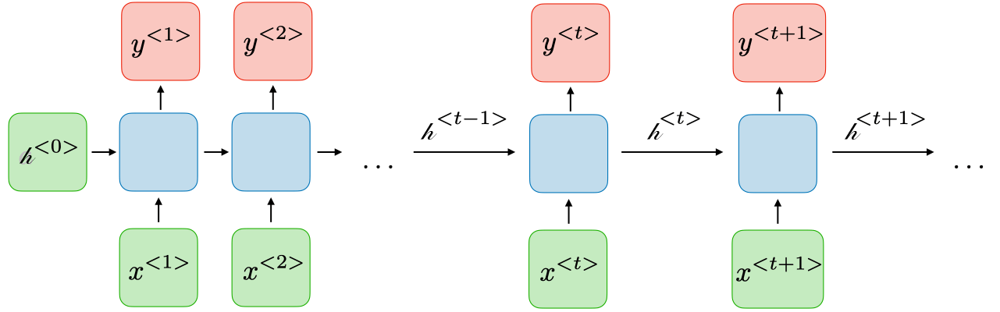
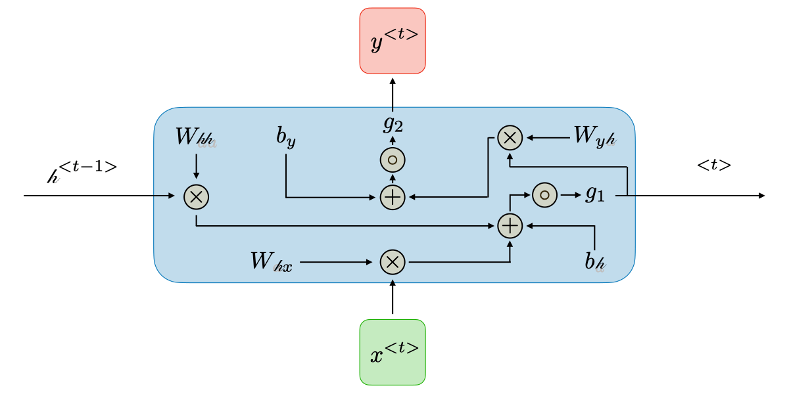

================================================
Introduction to Recurrent Neural Networks (RNNs)
================================================

.. contents:: Table of Contents
    :depth: 2

Mathematical Formulation
------------------------

Recurrent neural networks, also known as RNNs, are a class of neural networks that allow previous outputs to be used as
inputs while having hidden states. They are typically as follows:

For each timestep :math:`t` the activation :math:`a^{\langle t \rangle}` and the output :math:`y^{\langle t \rangle}` are expressed as follows:

.. math::

    h^{\langle t \rangle} = g_1\left( W_{hh}h^{\langle t - 1 \rangle} + W_{hx}x^{\langle t \rangle} + b_h \right)

    y^{\langle t \rangle} = g_2\left( W_{yh}h^{\langle t \rangle} + b_y \right)

where :math:`W_{hx}`, :math:`W_{hh}`, :math:`W_{yh}`, :math:`b_h`, :math:`b_y` are coefficients that are shared temporally and :math:`g_1`, :math:`g_2` are activation functions.

A Python implementation of network above, as an example, could be as follows:

.. code-block:: python

    import numpy as np
    from math import exp

    np.random.seed(0)
    class VanillaRecurrentNetwork(object):

        def __init__(self):
            self.hidden_state = np.zeros((3, 3))
            self.W_hh = np.random.randn(3, 3)
            self.W_xh = np.random.randn(3, 3)
            self.W_hy = np.random.randn(3, 3)
            self.Bh = np.random.randn(3,)
            self.By = np.random.rand(3,)

            self.hidden_state_activation_function = lambda x : np.tanh(x)
            self.y_activation_function = lambda x : x

        def forward_prop(self, x):
            self.hidden_state = self.hidden_state_activation_function(
                np.dot(self.hidden_state, self.W_hh) + np.dot(x, self.W_xh) + self.Bh
            )

            return self.y_activation_function(self.W_hy.dot(self.hidden_state) + self.By)

Notice the weight matrix above are randomly initialized. This makes it a "silly" network that doesn't help us anything
good:

.. code-block:: python

    input_vector = np.ones((3, 3))
    silly_network = RecurrentNetwork()

    # Notice that same input, but leads to different ouptut at every single time step.
    print silly_network.forward_prop(input_vector)
    print silly_network.forward_prop(input_vector)
    print silly_network.forward_prop(input_vector)

    # this gives us
    [[-1.73665315 -2.40366542 -2.72344361]
     [ 1.61591482  1.45557046  1.13262256]
     [ 1.68977504  1.54059305  1.21757531]]
    [[-2.15023381 -2.41205828 -2.71701457]
     [ 1.71962883  1.45767515  1.13101034]
     [ 1.80488553  1.542929    1.21578594]]
    [[-2.15024751 -2.41207375 -2.720968  ]
     [ 1.71963227  1.45767903  1.13200175]
     [ 1.80488935  1.54293331  1.21688628]]

This is because we haven't train our RNN network yet, which we discuss next

Training
--------

.. admonition:: Prerequisite

    We would assume some basic Artificial Neural Network concepts, which are drawn from *Chapter 4 - Artificial Neural
    Networks* (p. 81) of `MACHINE LEARNING by Mitchell, Thom M. (1997)`_ Paperback. Please, if possible, read the
    chapter beforehand and refer to it if something looks confusing in the discussion of this section

In the case of a recurrent neural network, we are essentially backpropagation through time, which means that we are
forwarding through entire sequence to compute losses, then backwarding through entire sequence to compute gradients.
Formally, the `loss function`_ :math:`\mathcal{L}` of all time steps is defined as the sum of
the loss at every time step:

.. math::

    \mathcal{L}\left( \hat{y}, y \right) = \sum_{t = 1}^{T_y}\mathcal{L}\left( \hat{y}^{<t>}, y^{<t>} \right)

However, this becomes problematic when we want to train a sequence that is very long. For example, if we were to train a
a paragraph of words, we have to iterate through many layers before we can compute one simple gradient step. In
practice, for the back propagation, we examine how the output at the very *last* timestep affects the weights at the
very first time step. Then we can compute the gradient of loss function, the details of which can be found in the
`Vanilla RNN Gradient Flow & Vanishing Gradient Problem`_

.. admonition:: Gradient Clipping

    Gradient clipping is a technique used to cope with the `exploding gradient`_ problem sometimes encountered when
    performing backpropagation. By capping the maximum value for the gradient, this phenomenon is controlled in
    practice.

    .. figure:: ../img/gradient-clipping.png
        :align: center

    In order to remedy the vanishing gradient problem, specific gates are used in some types of RNNs and usually have a
    well-defined purpose. They are usually noted :math:`\Gamma` and are defined as

    .. math::

        \Gamma = \sigma(Wx^{<t>} + Ua^{<t - 1>} + b)

    where :math:`W`, :math:`U`, and :math:`b` are coefficients specific to the gate and :math:`\sigma` is the sigmoid
    function

LSTM Formulation
^^^^^^^^^^^^^^^^

Now we know that Vanilla RNN has Vanishing/exploding gradient problem, `LSTM Formulation`_ discusses the theory of LSTM
which is used to remedy this problem.

Applications of RNNs
--------------------

RNN models are mostly used in the fields of natural language processing and speech recognition. The different
applications are summed up in the table below:

.. list-table:: Applications of RNNs
   :widths: 20 60 20
   :align: center
   :header-rows: 1

   * - Type of RNN
     - Illustration
     - Example
   * - | One-to-one
       | :math:`T_x = T_y = 1`
     - .. figure:: ../img/rnn-one-to-one-ltr.png
     - Traditional neural network
   * - | One-to-many
       | :math:`T_x = 1`, :math:`T_y > 1`
     - .. figure:: ../img/rnn-one-to-many-ltr.png
     - Music generation
   * - | Many-to-one
       | :math:`T_x > 1`, :math:`T_y = 1`
     - .. figure:: ../img/rnn-many-to-one-ltr.png
     - Sentiment classification
   * - | Many-to-many
       | :math:`T_x = T_y`
     - .. figure:: ../img/rnn-many-to-many-same-ltr.png
     - Named entity recognition
   * - | Many-to-many
       | :math:`T_x \ne T_y`
     - .. figure:: ../img/rnn-many-to-many-different-ltr.png
     - Machine translation

.. _`exploding gradient`: https://qubitpi.github.io/stanford-cs231n.github.io/rnn/#vanilla-rnn-gradient-flow--vanishing-gradient-problem

.. _`MACHINE LEARNING by Mitchell, Thom M. (1997)`: https://a.co/d/bjmsEOg

.. _`loss function`: https://qubitpi.github.io/stanford-cs231n.github.io/neural-networks-2/#losses
.. _`LSTM Formulation`: https://qubitpi.github.io/stanford-cs231n.github.io/rnn/#lstm-formulation

.. _`Vanilla RNN Gradient Flow & Vanishing Gradient Problem`: https://qubitpi.github.io/stanford-cs231n.github.io/rnn/#vanilla-rnn-gradient-flow--vanishing-gradient-problem
