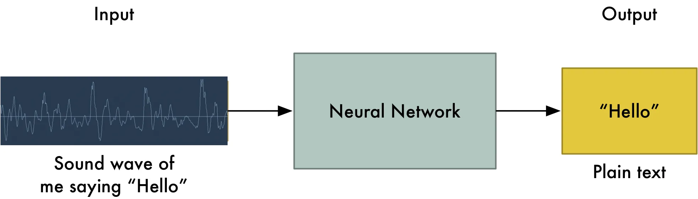
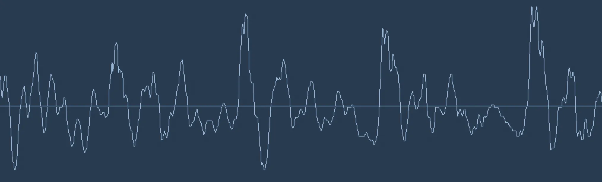
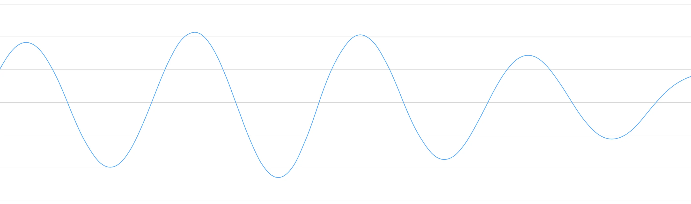
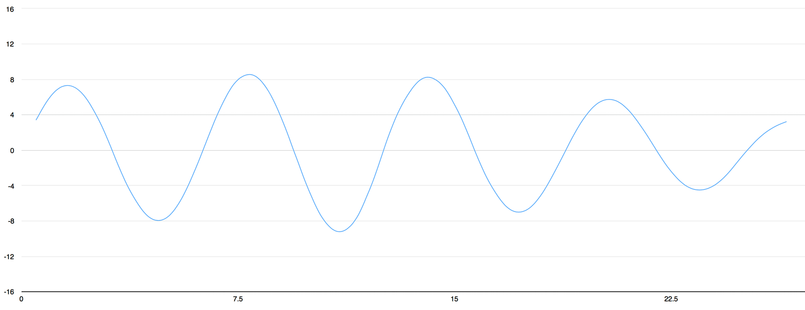
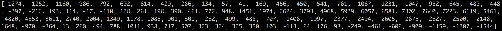

===============================
Speech Recognition with Lamassu
===============================

.. contents:: Table of Contents
    :depth: 2

Speech recognition will become a primary way that we interact with computers.

One might guess that we could simply feed sound recordings into a neural network and train it to produce text:

That's the holy grail of speech recognition with deep learning, but we aren't quite there yet. The big problem is that
speech varies in speed. One person might say "hello!" very quickly and another person might say
"heeeelllllllllllllooooo!" very slowly, producing a much longer sound file with much more data. Both sounds should be
recognized as exactly the same text - "hello!" Automatically aligning audio files of various lengths to a fixed-length
piece of text turns out to be pretty hard. To work around this, we have to use some special tricks and extra precessing.

Turning Sounds into Bits
========================

The first step in speech recognition is obvious — we need to feed sound waves into a computer. Sound is transmitted as
waves. A sound clip of someone saying "Hello" looks like

Sound waves are one-dimensional. At every moment in time, they have a single value based on the height of the wave.
Let's zoom in on one tiny part of the sound wave and take a look:

To turn this sound wave into numbers, we just record of the height of the wave at equally-spaced points:

This is called *sampling*. We are taking a reading thousands of times a second and recording a number representing the
height of the sound wave at that point in time. That's basically all an uncompressed .wav audio file is.

"CD Quality" audio is sampled at 44.1khz (44,100 readings per second). But for speech recognition, a sampling rate of
16khz (16,000 samples per second) is enough to cover the frequency range of human speech.

Lets sample our "Hello" sound wave 16,000 times per second. Here's the first 100 samples:

.. note:: Can digital samples perfectly recreate the original analog sound wave? What about those gaps?

   You might be thinking that sampling is only creating a rough approximation of the original sound wave because it's
   only taking occasional readings. There's gaps in between our readings so we must be losing data, right?

   .. figure:: ../img/real-vs-sampling.png
    :align: center

   But thanks to the `Nyquist theorem`_, we know that we can use math to perfectly reconstruct the original sound wave
   from the spaced-out samples — as long as we sample at least twice as fast as the highest frequency we want to record.

.. automodule:: lamassu.speech.sampling
   :members:
   :undoc-members:
   :show-inheritance:

.. _`Nyquist theorem`: https://en.wikipedia.org/wiki/Nyquist%E2%80%93Shannon_sampling_theorem
